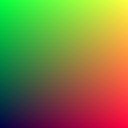
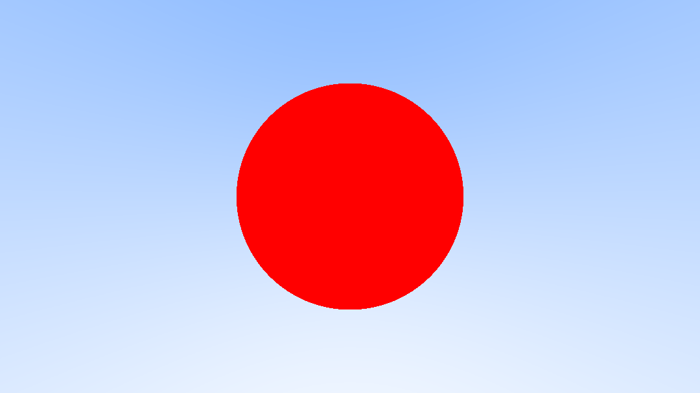

# What is this?
The following is a verbatim copy of Peter Shirley's **Ray Tracing in One Weekend** book (version 3.2.3, 2020-12-07), with the following changes:
 - The language has been changed from C++ to C.
 - All paragraphs expounding upon language-specific properties of the code have been re-written in order to reflect the re-written code in C.
 - Additional sections have been added with brief explanations of the underlying math or tangential topics such as build systems.
 - Instead of writing image data to *stdout*, the programs in this repo take an additional command line argument specifying a filename. When the programs are run, image data is written to this file. *stdout* is used purely for logging.

All sentences and paragraphs that I have changed or added are rendered in **bold** - I love the original book and do not want to leave the impression that I am putting words in Peter Shirley's mouth, or imply that my knowledge or the subject is more advanced than or even on the same level to his. The intent is purely to make a version of Ray Tracing in One Weekend that is slightly more accessible to people who are more comfortable with C as opposed to C++ while brushing up on my linear algebra.

The original book in C++ can be read for free [here](https://raytracing.github.io/books/RayTracingInOneWeekend.html), or can be bought [here](https://www.amazon.de/Tracing-Weekend-Minibooks-Book-English-ebook/dp/B01B5AODD8).

## General remarks
The state of the code as it is in a specific chapter in the book can be found in the directory labeled with the corresponding section number.

# Ray Tracing in One Weekend

[Peter Shirley](https://github.com/petershirley), edited by [Steve Hollasch](https://github.com/hollasch) and [Trevor David Black](https://github.com/trevordblack)

Version 3.2.3, 2020-12-07 (Modified)

Copyright 2018-2020 Peter Shirley. All rights reserved.

## Contents
1. [Overview](#1.-overview)
2. [Output an Image](#2.-output-an-image)
    1. The PPM Image format
    2. Creating an Image File
    3. Adding a Progress Indicator

## 1. Overview
**Note: The following section has been left unchanged as it expresses the author's reasoning for decisions that impacted the unmodified version of the text. The section concerning C++ does not apply to this, modified version of the book but the expressed ideas are still benefiecial to the reader.**

 I’ve taught many graphics classes over the years. Often I do them in ray tracing, because you are forced to write all the code, but you can still get cool images with no API. I decided to adapt my course notes into a how-to, to get you to a cool program as quickly as possible. It will not be a full-featured ray tracer, but it does have the indirect lighting which has made ray tracing a staple in movies. Follow these steps, and the architecture of the ray tracer you produce will be good for extending to a more extensive ray tracer if you get excited and want to pursue that.

When somebody says “ray tracing” it could mean many things. What I am going to describe is technically a path tracer, and a fairly general one. While the code will be pretty simple (let the computer do the work!) I think you’ll be very happy with the images you can make.

I’ll take you through writing a ray tracer in the order I do it, along with some debugging tips. By the end, you will have a ray tracer that produces some great images. You should be able to do this in a weekend. If you take longer, don’t worry about it. I use C++ as the driving language, but you don’t need to. However, I suggest you do, because it’s fast, portable, and most production movie and video game renderers are written in C++. Note that I avoid most “modern features” of C++, but inheritance and operator overloading are too useful for ray tracers to pass on. I do not provide the code online, but the code is real and I show all of it except for a few straightforward operators in the vec3 class. I am a big believer in typing in code to learn it, but when code is available I use it, so I only practice what I preach when the code is not available. So don’t ask!

I have left that last part in because it is funny what a 180 I have done. Several readers ended up with subtle errors that were helped when we compared code. So please do type in the code, but if you want to look at mine it is at:

https://github.com/RayTracing/raytracing.github.io/

I assume a little bit of familiarity with vectors (like dot product and vector addition). If you don’t know that, do a little review. If you need that review, or to learn it for the first time, check out Marschner’s and my graphics text, Foley, Van Dam, et al., or McGuire’s graphics codex.

If you run into trouble, or do something cool you’d like to show somebody, send me some email at ptrshrl@gmail.com.

I’ll be maintaining a site related to the book including further reading and links to resources at a blog https://in1weekend.blogspot.com/ related to this book.

Thanks to everyone who lent a hand on this project. You can find them in the acknowledgments section at the end of this book.

Let’s get on with it!

## 2. Output an Image
### 2.1. The PPM Image Format

Whenever you start a renderer, you need a way to see an image. The most straightforward way is to write it to a file. The catch is, there are so many formats. Many of those are complex. I always start with a plain text ppm file. Here’s a nice description from Wikipedia:


<div align="center"><b>Figure 1:</b> PPM Example</div><br/>

**Let’s make some C code to output such a thing:**

```c
#include <stdio.h>

#define IMG_WIDTH 256
#define IMG_HEIGHT 256

int main(int argc, char *argv[]) {
    FILE *output_file = fopen("out.ppm", "w");

    if (output_file == NULL) {
        fprintf(stderr, "Could not open file\n");
        exit(1);
    }

    fprintf(output_file, "P3\n%d %d\n255\n", IMG_WIDTH, IMG_HEIGHT);

    for (int j = IMG_HEIGHT - 1; j >= 0; j--) {
        for (int i = 0; i < IMG_WIDTH; i++) {
            double r = ((double) i / (IMG_WIDTH - 1));
            double g = ((double) j / (IMG_HEIGHT - 1));
            double b = 0.25;

            int ir = (int) (255.999 * r);
            int ig = (int) (255.999 * g);
            int ib = (int) (255.999 * b);

            fprintf(output_file, "%d %d %d\n", ir, ig, ib);
        }
    }

    fflush(output_file);
    fclose(output_file);
}
```
<div align="center"><b>Listing 1:</b> [main.c] Creating your first image</div><br/>

There are some things to note in that code:
1. The pixels are written out in rows with pixels left to right.
2. The rows are written out from top to bottom.
3. By convention, each of the red/green/blue components range from 0.0 to 1.0. We will relax that later when we internally use high dynamic range, but before output we will tone map to the zero to one range, so this code won’t change.
4. Red goes from fully off (black) to fully on (bright red) from left to right, and green goes from black at the bottom to fully on at the top. Red and green together make yellow so we should expect the upper right corner to be yellow.

### 2.2. Creating an Image File

**Since the image data isn't written to *stdout* we cannot use output redirection to create an image file. The program in *Listing 1* is hard-coded to always create (or overwrite) a file called `out.ppm`, but we may want the option to give our images custom names. In the following section, we'll make it so that a filename can be specified via command line argument, as so:**

`raytracer [FILE]`  
`Where FILE is a filename ending with .ppm`

**We always want our output file to end with .ppm so it makes sense to write a simple function for input validation. Let's create a new file called `utils.h` and populate it as so:**

```c
#include <stdio.h>
#include <stdlib.h>
#include <string.h>

void print_usage();
int validate_filename(const char *filename);

void print_usage() {
    printf( "Usage:\n\t"
            "raytracer [FILE]\n\t"
            "Where FILE is a filename ending with .ppm\n"
          );
}

int validate_filename(const char *filename) {
    if (filename == NULL) {
        return 0;
    }

    size_t len = strlen(filename);
    if ((len > FILENAME_MAX) || (len < 5)) {
        return 0;
    }

    if (strcmp(&filename[len - 4 /* Length of .ppm extension */], ".ppm") == 0) {
        return 1;
    }

    return 0;
}
```
<div align="center"><b>Listing 1a:</b> [utils.h] Some simple utility functions</div><br/>

**The `validate_input` function is rudimentary but will do for now. All it does is check that the given filename is a string ending with but not consisting entirely of the characters ".ppm" and that it is not too long for the operating system. `print_usage` can be output in case of error to let the user know what kind of input is expected of them. When we insert the above functions into our code we get this:**

```c
#include <stdio.h>
#include <errno.h>
#include "utils.h"

#define IMG_WIDTH 256
#define IMG_HEIGHT 256

int main(int argc, char *argv[]) {
    if (argc != 2) {
        fprintf(stderr, "Invalid or no arguments supplied. See usage below:\n");
        print_usage();
        exit(1);
    }

    if (!validate_filename(argv[1])) {
        fprintf(stderr, "Invalid filename argument supplied. See usage below:\n");
        print_usage();
        exit(1);
    }

    FILE *output_file = fopen(argv[1], "w");

    if (output_file == NULL) {
        fprintf(stderr, "Could not open file %s\n", argv[1]);
        perror(NULL);
        exit(1);
    }

    fprintf(output_file, "P3\n%d %d\n255\n", IMG_WIDTH, IMG_HEIGHT);

    for (int j = IMG_HEIGHT - 1; j >= 0; j--) {
        for (int i = 0; i < IMG_WIDTH; i++) {
            double r = ((double) i / (IMG_WIDTH - 1));
            double g = ((double) j / (IMG_HEIGHT - 1));
            double b = 0.25;

            int ir = (int) (255.999 * r);
            int ig = (int) (255.999 * g);
            int ib = (int) (255.999 * b);

            fprintf(output_file, "%d %d %d\n", ir, ig, ib);
        }
    }

    fflush(output_file);
    fclose(output_file);
}
```
<div align="center"><b>Listing 1b:</b> [main.c] Specifying the output filename</div><br/>

**Now that we have two separate code files (with many more to come) it makes sense to include a build system into the project. Since this is meant to be a book focusing on ray tracing, I will only give a quick and cursory account of a specific build system, *Makefile*. In case you're already familiar with it or just not interested, feel free to skip this section. If you would like to learn more about makefiles, I recommend [this website](https://makefiletutorial.com/).**

**Create a new file in the project's root directory called `Makefile`. Makefiles are used to specify and track dependencies between files. With one set up, we can simply run `make` from the command line and it will automatically check for changes in the source code, recompiling executables and object files as needed.**

**Let's insert the following into our makefile:**

```Makefile
CC=gcc # Or replace gcc with whichever compiler you're using
CFLAGS=-Werror -Wextra -pedantic
EXECUTABLE=raytracer

$(EXECUTABLE): main.c utils.h
	$(CC) -o $(EXECUTABLE) $(CFLAGS) main.c
```

**The above expresses that our executable file (`raytracer`) depends on the source files `main.c` and `utils.h`. As a result, whenever we run `make` after changing either of these files the build system will recognize that the executable is out of date and run the chain of commands specified in the indented line under `$(EXECUTABLE): main.c utils.h`.**

**The makefile will be refined further as the project becomes more complex, but I will not spend any more time on explaining its inner mechanics. If you're interested on seeing its state at a specific stage in the project's development, check its specific subsection directory. For a deeper read on the topic or if you want to look up a specific feature I recommend reading up [here](https://makefiletutorial.com/).**

**Now all you need to do is run the command `make`. Your shell should output something along the lines of `gcc -o raytracer -Werror -Wextra -pedantic main.c` and you should find a new file called `raytracer` in your project's directory. If this is the case, run `raytracer image.ppm` and open the resulting file in the image viewer of your choice. This is the result:**


<div align="center"><b>Figure 1:</b> First PPM image</div><br/>

Hooray! This is the graphics “hello world”. If your image doesn’t look like that, open the output file in a text editor and see what it looks like. It should start something like this:

```
P3
256 256
255
0 255 63
1 255 63
2 255 63
3 255 63
4 255 63
5 255 63
6 255 63
7 255 63
8 255 63
9 255 63
...
```
<div align="center"><b>Listing 2:</b> First image output</div><br/>

If it doesn’t, then you probably just have some newlines or something similar that is confusing the image reader. 

If you want to produce more image types than PPM, I am a fan of stb_image.h, a header-only image library available on GitHub at https://github.com/nothings/stb.

### 2.3. Adding a Progress Indicator

Before we continue, let's add a progress indicator to our output. This is a handy way to track the progress of a long render, and also to possibly identify a run that's stalled out due to an infinite loop or other problem.

```c
    for (int j = IMG_HEIGHT - 1; j >= 0; j--) {
        printf("\rScanlines remaining: %d ", j);
        for (int i = 0; i < IMG_WIDTH; i++) {
            double r = ((double) i / (IMG_WIDTH - 1));
            double g = ((double) j / (IMG_HEIGHT - 1));
            double b = 0.25;

            int ir = (int) (255.999 * r);
            int ig = (int) (255.999 * g);
            int ib = (int) (255.999 * b);

            fprintf(output_file, "%d %d %d\n", ir, ig, ib);
        }
    }

    printf("\nDone.\n");
```
<div align="center"><b>Listing 3:</b> [main.c] Main render loop with progress reporting</div><br/>

## 3. The vec3 Data Structure

Almost all graphics programs have some class(es) for storing geometric vectors and colors. In many systems these vectors are 4D (3D plus a homogeneous coordinate for geometry, and RGB plus an alpha transparency channel for colors). For our purposes, three coordinates suffices. **Unlike the original book, we won't be using the same `vec3` type for everything, but we also won't be too strict about it. The original C++ implementation expresses vectors, points and colors using the same datatype. I will be drawing a hard line between vectors and colors, but not between vectors and points. It is not useful at all to have the option of, for example, computing the dot product of a color and vector whereas points and vectors both inhabit the same abstract space and are mathematically comparable. In the course of this exercise scenarios will come up where treating points as if they were vectors will be practical as it saves us having to accomodate a whole new datatype in our utility functions. As such, `point3_t` will not be a separate typedef. Instead, it will be a macro that resolves to `vec3_t`. This should serve the purpose of communicating intent to humans who read this code while making no difference at all to the compiler.**

### 3.1 Variables and Methods

Here is the vec3.h header file:
```c
#ifndef VEC3
#define VEC3

typedef struct {
    double x;
    double y;
    double z;
} vec3_t;

#define point3_t vec3_t

vec3_t vec3_add(vec3_t v, vec3_t u);
vec3_t vec3_sub(vec3_t v, vec3_t u);
vec3_t vec3_scalar_mul(vec3_t v, double s);
vec3_t vec3_scalar_div(vec3_t v, double s);

double vec3_dot(vec3_t v, vec3_t u);
vec3_t vec3_cross(vec3_t v, vec3_t u);
vec3_t vec3_unit_vec(vec3_t v);

double vec3_len(vec3_t v);
double vec3_len_squared(vec3_t v);
#endif
``` 
<div align="center"><b>Listing 4:</b> [vec3.h] vec3 datatype</div><br/>

We use `double` here, but some ray tracers use `float`. Either one is fine — follow your own tastes.

### 3.2 vec3 Utility Function Implementation

The corresponding function implementations can be found in vec3.c:

```c
vec3_t vec3_add(vec3_t v, vec3_t u) {
    vec3_t retval = {
        .x = v.x + u.x,
        .y = v.y + u.y,
        .z = v.z + u.z
        };

    return retval;
}

vec3_t vec3_sub(vec3_t v, vec3_t u) {
    vec3_t retval = {
        .x = v.x - u.x,
        .y = v.y - u.y,
        .z = v.z - u.z
        };

    return retval;
}

vec3_t vec3_scalar_mul(vec3_t v, double s) {
    vec3_t retval = {
        .x = v.x * s,
        .y = v.y * s,
        .z = v.z * s
        };

    return retval;
}

vec3_t vec3_scalar_div(vec3_t v, double s) {
    vec3_t retval = {
        .x = v.x / s,
        .y = v.y / s,
        .z = v.z / s
        };

    return retval;
}

double vec3_dot(vec3_t v, vec3_t u) {
    return (v.x * u.x) + (v.y * u.y) + (v.z * u.z);
}

vec3_t vec3_cross(vec3_t v, vec3_t u) {
    vec3_t retval = {
        .x = (v.y * u.z) - (v.z * u.y),
        .y = (v.z * u.x) - (v.x * u.z),
        .z = (v.x * u.y) - (v.y * u.x)
    };

    return retval;
}

vec3_t vec3_unit_vec(vec3_t v) {
    return vec3_scalar_div(v, vec3_len(v));
}

double vec3_len(vec3_t v) {
    return sqrt(vec3_len_squared(v));
}

double vec3_len_squared(vec3_t v) {
    return (v.x * v.x) + (v.y * v.y) + (v.z * v.z);
}
```
<div align="center"><b>Listing 5:</b> [vec3.c] vec3 utility functions</div><br/>

### 3.3 Color utility functions

Let's create a new header file defining a datatype we can use to represent colors:
```c
#ifndef COLOR
#define COLOR

#include <stdio.h>

typedef struct {
    double r;
    double g;
    double b;
} color_t;

void write_color(FILE* file, color_t pixel_color);

#endif
```
And implement a utility function to write a single pixel's color to a given file pointer:

```c
void write_color(FILE* file, color_t pixel_color) {
    if (file == NULL) {
        fprintf(stderr, "Error: invalid file passed to \"write_color\"");
        return;
    }

    fprintf(
            file,
            "%d %d %d\n", 
            ((int) (255.999 * pixel_color.r)),
            ((int) (255.999 * pixel_color.g)),
            ((int) (255.999 * pixel_color.b))
            );
}
```
<div align="center"><b>Listing 6:</b> [color.c] color utility functions</div><br/>

Now we can change out main to use this:

```c
    fprintf(output_file, "P3\n%d %d\n255\n", IMG_WIDTH, IMG_HEIGHT);

    for (int j = IMG_HEIGHT - 1; j >= 0; j--) {
        printf("\rScanlines remaining: %d ", j);
        for (int i = 0; i < IMG_WIDTH; i++) {
            color_t pixel_color = {
                .r = ((double) i / (IMG_WIDTH - 1)),
                .g = ((double) j / (IMG_HEIGHT - 1)),
                .b = 0.25
            };

            write_color(output_file, pixel_color);
        }
    }

    printf("\nDone.\n");
    fflush(output_file);
    fclose(output_file);
```
<div align="center"><b>Listing 7:</b> [main.c] Final code for the first PPM image</div><br/>

## 4. Rays, a Simple Camera, and Background

### 4.1. The ray Datatype

The one thing that all ray tracers have is a ray class or datatype and a computation of what color is seen along a ray. Let’s think of a ray as a function $P(t)=A+t \cdot b$. Here P is a 3D position along a line in 3D. $A$ is the ray origin and $b$ is the ray direction. The ray parameter $t$ is a real number (`double` in the code). Plug in a different $t$ and $P(t)$ moves the point along the ray. Add in negative $t$ values and you can go anywhere on the 3D line. For positive $t$, you get only the parts in front of $A$, and this is what is often called a half-line or ray. 


<div align="center"><b>Figure 2:</b> Linear interpolation</div><br/>

The function $P(t)$ in more verbose code form will be called `ray_at(ray_t r, double t)`:
```c
#ifndef RAY_H
#define RAY_H

#include "../vec3/vec3.h"

typedef struct {
    point3_t origin;
    vec3_t direction;
} ray_t;

point3_t ray_at(ray_t r, double t);

#endif
```
<div align="center"><b>Listing 8:</b> [ray.h] The ray datatype</div><br/>

And will be implemented as so:

```c
point3_t ray_at(ray_t r, double t) {
    vec3_t tb = vec3_scalar_mul(r.direction, t);

    point3_t retval = {
        .x = r.origin.x + tb.x,
        .y = r.origin.y + tb.y,
        .z = r.origin.z + tb.z,
    };
    
    return retval;
}
```
<div align="center"><b>Listing 8a:</b> [ray.c] ray_at implementation</div><br/>

### 4.2 Sending Rays Into the Scenes

Now we are ready to turn the corner and make a ray tracer. At the core, the ray tracer sends rays through pixels and computes the color seen in the direction of those rays. The involved steps are (1) calculate the ray from the eye to the pixel, (2) determine which objects the ray intersects, and (3) compute a color for that intersection point. When first developing a ray tracer, I always do a simple camera for getting the code up and running. I also make a simple `ray_color(ray)` function that returns the color of the background (a simple gradient). 

I’ve often gotten into trouble using square images for debugging because I transpose x and y too often, so I’ll use a non-square image. For now we'll use a 16:9 aspect ratio, since that's so common. 

In addition to setting up the pixel dimensions for the rendered image, we also need to set up a virtual viewport through which to pass our scene rays. For the standard square pixel spacing, the viewport's aspect ratio should be the same as our rendered image. We'll just pick a viewport two units in height. We'll also set the distance between the projection plane and the projection point to be one unit. This is referred to as the “focal length”, not to be confused with “focus distance”, which we'll present later.

I’ll put the “eye” (or camera center if you think of a camera) at $(0,0,0)$. I will have the y-axis go up, and the x-axis to the right. In order to respect the convention of a right handed coordinate system, into the screen is the negative z-axis. I will traverse the screen from the upper left hand corner, and use two offset vectors along the screen sides to move the ray endpoint across the screen. Note that I do not make the ray direction a unit length vector because I think not doing that makes for simpler and slightly faster code.


<div align="center"><b>Figure 3:</b> Camera geometry</div><br/>

**!!! TODO: Introduce the camera a bit earlier !!!**

Below in code, the ray `r` goes to approximately the pixel centers (I won’t worry about exactness for now because we’ll add antialiasing later): 

```c
#define ASPECT_RATIO (16.0 / 9.0)
#define IMG_WIDTH 1080
#define IMG_HEIGHT ((int) (IMG_WIDTH / ASPECT_RATIO))

int main(int argc, char *argv[]) {

    camera_t camera;

    camera.aspect_ratio = ASPECT_RATIO;
    camera.viewport_height = 2.0;
    camera.viewport_width = camera.aspect_ratio * camera.viewport_height;
    camera.focal_len = 1.0;

    camera.origin = (point3_t) { 0, 0, 0 };

    camera.horizontal = (vec3_t) { .x = camera.viewport_width, .y = 0, .z = 0 };
    camera.vertical = (vec3_t) { .x = 0, .y = camera.viewport_height, .z = 0 };
    camera.lower_left_corner = calculate_lower_left_corner(camera.origin, camera.horizontal, camera.vertical, camera.focal_len);

    fprintf(output_file, "P3\n%d %d\n255\n", IMG_WIDTH, IMG_HEIGHT);

    for (int j = IMG_HEIGHT - 1; j >= 0; j--) {
        printf("\rScanlines remaining: %d ", j);
        for (int i = 0; i < IMG_WIDTH; i++) {
            double u = ((double) i / (IMG_WIDTH - 1));
            double v = ((double) j / (IMG_HEIGHT - 1));

            ray_t r = get_ray(camera, u, v);

            color_t pixel_color = ray_color(r);

            write_color(output_file, pixel_color);
        }
    }

    printf("\nDone.\n");
    fflush(output_file);
    fclose(output_file);
}
```
<div align="center"><b>Listing 9:</b> [main.c] Rendering a blue-to-white gradient</div><br/>

The `ray_color(ray)` function linearly blends white and blue depending on the height of the y coordinate after scaling the ray direction to unit length (so $−1.0 < y < 1.0$). Because we're looking at the y height after normalizing the vector, you'll notice a horizontal gradient to the color in addition to the vertical gradient.

I then did a standard graphics trick of scaling that to $0.0 \le t \le 1.0$. When $t=1.0$ I want blue. When $t=0.0$ I want white. In between, I want a blend. This forms a “linear blend”, or “linear interpolation”, or “lerp” for short, between two things. A lerp is always of the form

$$ blendedValue = (1 - t) \cdot startValue + t \cdot endValue $$

with $t$ going from zero to one. In our case this produces:


<div align="center"><b>Image 2:</b> A blue-to-white gradient depending on ray Y coordinate</div><br/>

## 5. Adding a sphere

Lets's add a single object to out ray tracer. People often use spheres in ray tracers because calculating whether a ray hits a sphere is pretty straightforward.

### 5.1 Ray-Sphere Intersection

Recall that the equation for a sphere centered at the origin of radius $R$ is

$$x^2 + y^2 + z^2 = R^2$$

Put another way, if a given point $(x, y, z)$ is *on* the sphere, then $x^2 + y^2 + z^2 = R^2$. If the given point, $(x, y, z)$ is *inside* the sphere, then $x^2 + y^2 + z^2 < R^2$, and if a given point is *outside* the sphere, then $x^2 + y^2 + z^2 > R^2$.

It gets uglier if the sphere center is at $(Cx, Cy, Cz)$:

$$(x - Cx)^2 + (y - Cy)^2 + (z - Cz)^2 = r^2$$

In graphics, you almost always want your formulas to be in terms of vectors so all the x/y/z stuff is under the hood in the `vec3` class (or in our case, the procedures operating on the `vec3_t` datatype). You might note that the vector from center ${\bf C} = (Cx, Cy, Cz)$ to point ${\bf P } = (x, y, z)$ is $({\bf P} - {\bf C})$, and therefore

$$({\bf P} - {\bf C}) \cdot ({\bf P} - {\bf C}) = (x - Cx)^2 + (y - Cy)^2 + (z - Cz)^2$$ 

So the equation of the sphere in vector form is:

$$({\bf P} - {\bf C}) \cdot ({\bf P} - {\bf C}) = r^2$$

We can read this as "Any point ${\bf P}$" that satisfies this equation is on the sphere". We want to know if our ray ${\bf P}(t) = {\bf A} + {\it t}{\bf b}$ ever hits the sphere anywhere. If it does hit the sphere, there is some $t$ for which ${\bf P}(t)$ satisfies the equation. So we are looking for any $t$ where this is true:

$$({\bf P}(t) - {\bf C}) \cdot ({\bf P}(t) - {\bf C}) = r^2$$

Or expanding the full form of the ray ${\bf P}(t)$:

$$({\bf A} + {\it t}{\bf b} - {\bf C}) \cdot ({\bf A} + {\it t}{\bf b} - {\bf C}) = r^2$$

The rules of vector algebra are all that we would want here. If we expand that equation and move all terms to the left hand side we get:

$$t^2{\bf b} \cdot {\bf b} + 2t{\bf b} \cdot ({\bf A} - {\bf C}) + ({\bf A} - {\bf C}) \cdot ({\bf A} - {\bf C}) - r^2 = 0$$

The vectors and $r$ in that equation are all constant and known. The unknown is $t$, and the equation is a quadratic, like you probably saw in your high school math class. You can solve for $t$ and there is a square root part that is either positive (meaning two real solutions), zero (meaning one real solution) or negative (meaning no real solutions). In graphics, the algebra almost always relates very directly to the geometry. What we have is:


<div align="center"><b>Figure 4:</b> Ray-sphere intersection results</div><br/>

**That square root part is called the *discriminant* of a quadratic equation. So, how do we go about computing it? All we need to do is implement a simple formula. The generalized form of a quadratic equation looks like this:**

$$ax^2 + bx + c = 0$$

**And the discriminant can be calculated using the following:**

$$b^2 - 4ac$$

**By substituting $a$, $b$ and $c$ with the expanded terms from the eqation preceding figure 4, we get the exact items we need to compute:**

$$a = {\bf b} \cdot {\bf b}$$

$$b = 2 {\bf b} \cdot ({\bf A} - {\bf C})$$

$$c = ({\bf A} - {\bf C}) \cdot ({\bf A} - {\bf C}) - r^2$$

**Plugging these values into the formula for the discriminant lets us determine whether a ray intersects a given sphere.**

### 5.2 Creating Our First Raytraced Image

If we take that math and hard-code it into our program, we can test it by coloring red any pixel that hits a small sphere we place at −1 on the z-axis: 

```c
int hit_sphere(point3_t center, double radius, ray_t r) {
    // A vector from the sphere center to the origin, or (A - C)
    vec3_t oc = vec3_sub(r.origin, center);

    // b * b
    double a = vec3_dot(r.direction, r.direction);

    // 2b * (A - C)
    double b = 2.0 * vec3_dot(oc, r.direction);

    // (A - C) * (A - C) - (r * r)
    double c = vec3_dot(oc, oc) - (radius * radius);

    // b^2 - 4ac
    double discriminant = (b * b) - (4 * a * c);

    return (discriminant > 0);
}

color_t ray_color(ray_t r) {
    if (hit_sphere((point3_t) {0, 0, -1}, 0.5, r)) {
        return (color_t) {1, 0, 0};
    }

    vec3_t unit_direction = vec3_unit_vec(r.direction);
    double t = 0.5 * (unit_direction.y + 1.0);
    return add_color(scale_color((color_t) {1.0, 1.0, 1.0}, (1.0 - t)), scale_color((color_t) {0.5, 0.7, 1.0}, t));
}
```
<div align="center"><b>Listing 10:</b> [ray.c] Rendering a red sphere</div><br/>

What we get is this:


<div align="center"><b>Image 3:</b> A simple red sphere</div><br/>
